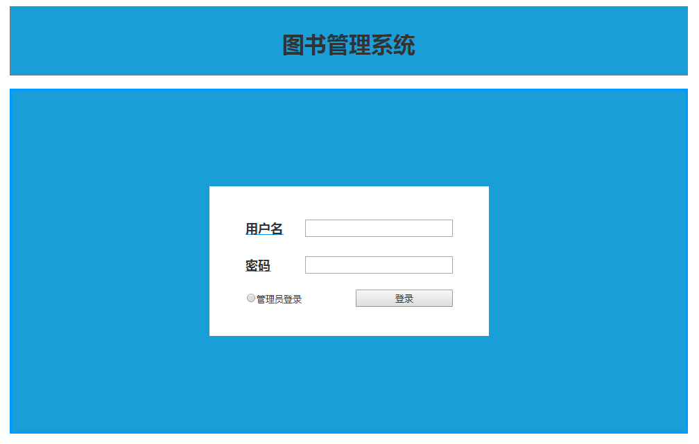
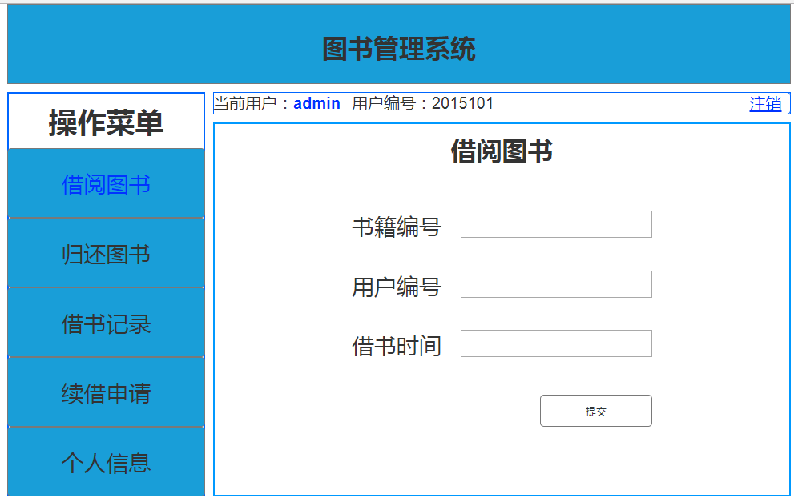

# 实验5 图书管理系统数据库设计与界面设计
|    学号    |       班级       |      姓名     |    照片    |
|:-------:|:------------- | ----------:|----------:|
|   201510414306  |     2015级3班    |   李俊峰   |   |
## 1、全部数据表设计如下

##### 数据表1.1 馆藏资源品种-res
|    项目   |       字段名       |      类型与宽度     |   主键是否    |   空值是否允许  |
|:-------|:------------- | :----------|:----------|:---------|
|   资源名称  |     resourceName    |   varchar(60)   |  否      |   否     |
|   国际出版号  |     publishingID    |   varchar(20)   |  否      |   否     |
|   价格  |     resourcePrice    |   float   |  否      |   否     |    |
|   简介  |     resourceIntroduction    |   varchar(100)   |  否      |   否     |
|   馆藏数量  |     resourceNumber    |   short   |  否      |   否     |    |
|   可借数量  |     resourceHaveNumber   |   short   |  否      |   否     |

##### 数据表1.2 资源项-resItem
|    项目   |       字段名       |      类型与宽度     |   是否主键    |   是否允许空值  |  说明 |
|:-------|:------------- | :----------|:----------|:---------|:-----|
|   馆藏流水号  |     resourceFlowNumber    |   varchar(20)   |  是      |   否     | 由入馆时间14位加当日流水5位组成，如果当日流水超过5位，则当日不可入馆 |
|   借阅状态  |     resourceStatus    |   short   |  否      |   否     |  0：表示正常；1：借空；2：超期；3：丢失；4：被盗；5：损坏:6：其他  |

##### 数据表1.3 图书品种-books
|    项目   |       字段名       |      类型与宽度     |   是否主键    |   是否允许空值  |  说明 |
|:-------|:------------- | :----------|:----------|:---------|:-----|
|   作者  |     bookAuthor    |   varchar(30)   |  否      |   否     |  考虑到有些外国作者名字较长，所以预留长度为30  |
|   出版社  |     bookPublishHouse    |   varchar(20)   |  否      |   否     |    |
|   出版日期  |     bookPublishDate    |   date   |  否      |   否     |    |
|   图书售价  |     bookPrice    |   int   |  否      |   否     |    |

##### 数据表1.4 借书记录-borrowBook
|    项目   |       字段名       |      类型与宽度     |   是否主键    |   是否允许空值  |  说明 |
|:-------|:------------- | :----------|:----------|:---------|:-----|
|   资源编码  |     resourceName    |   varchar(60)   |  是      |   否     | 当前借书操作的日期 |
|   借书卡号  |     userBorrowID    |   varchar(13)   |  否      |   否     |  如同学工号  |
|   借书日期  |     borrowDate    |   date   |  否      |   否     | 当前借书操作的日期 |
|   应还日期  |     shouldReturnDate    |   date   |  否      |   否     | 应还日期为借书日期后1月 |
|   归还日期  |     returnDate    |   date   |  否      |   是    | 同一用户同一本书续借超过4个月，则有1个月冷却时间，冷却过后才能再次借该书 |

##### 数据表1.5 读者-reader
|    项目   |       字段名       |      类型与宽度     |   是否主键    |   是否允许空值  |  说明 |
|:-------|:------------- | :----------|:----------|:---------|:-----|
|   姓名  |     userName    |   varchar(30)   |  否      |   否     |    |
|   借书卡号  |     userBorrowID    |   varchar(13)   |  是      |   否     |  如同学工号  |
|   身份证号  |     userIDcard    |   varchar(18)  |  否      |   否     |  注册用户必须实名认证，此项目加密保存  |
|   图书限额  |     userQuota    |   short   |  否      |   否     |  默认值为5，最大值不可超过10  |
|   剩余图书数  |     userHaveBorrowedBookNum    |   short   |  否      |   否     |   默认为0 |

##### 数据表1.8 图书管理员-librarians
|    项目   |       字段名       |      类型与宽度     |   是否主键    |   是否允许空值  |  说明 |
|:-------|:------------- | :----------|:----------|:---------|:-----|
|   职工号  |     librarianID    |   varchar(11)   |  是      |   否     | 加密保存，系统管理员为每个图书管理员分配唯一的包含字母和数字的管理员ID，管理员通过ID和姓名登录 |
|   姓名  |     librarianName    |   varchar(20)   |  否      |   否     |  加密保存，为了安全，名字可不必为真实名字  |
|   性别  |     librarianName    |   varchar(4)   |  否      |   否     |  加密保存，为了安全，名字可不必为真实名字  |
|  负责内容  |     librarianName    |   varchar(30)   |  否      |   否     |  加密保存，为了安全，名字可不必为真实名字  |


## 2、界面设计-借书界面设计
## 2.1. 登录界面设计

## 2.2. 借阅图书界面设计

* 说明：<br>
1.图书管理员可以在页面中进行图书信息的搜索；<br>
2.搜索相关图书将会展示在中间列表；<br>
3.点击要借阅的图书；<br>
4.便可以在左侧显示所点击将要借阅图书的相关信息。<br>
5.点击借阅，借书成功。
## 3、接口设计
### 3.1 接口调用说明
- 功能：用于查询图书分类目录
- 支持格式:json/xml
- 请求地址：http://api.yi18.net/book/bookclass
- 请求示例:请求示例：http://api.yi18.net/book/search?keyword=资本论
- 请求方法：POST
- 请求参数： Allow

| 参数名称       | 必填  | 说明 |
|:--------------|:-----|:-------|
| access_token | 是    | 用于验证请求合法性的认证信息 |
|method       |是     |固定为GET|
|version      |是     |客户端版本号|
|resource_name| 否|图书名称|
|author|否|作者|
|publish_house|否|出版社|
|publish_year|否|年份|
|type|否|图书类型|
|ISBN|否|图书ISBN编号|

- 返回实例：
```
{
       {
       "resultcode":"200",
       "reason":"Success",
       "result":{
       "data":[
         {
            "title":"小猪佩奇历险记",
            "catalog":"社会 儿童 小说 ",
            "tags":"小孩子最爱看的图书 ",
             "reading":"9999人阅读",
            "bytime":"2018年4月28日"
          }
        ],
       "totalNum":"9",
       "pn":0,
       "rn":"1"
        }
       }
```
- 返回参数说明：

|参数名称|说明|
|:-------:|:-------------: |
|result|返回信息|
|data|获取的图书信息|
|200|返回码|